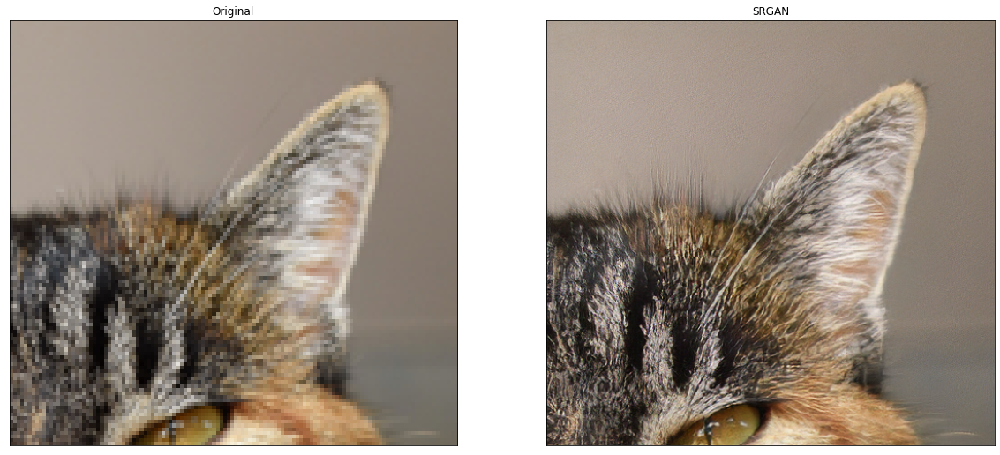

# Single Image Super-Resolution with SRGAN (Incomplete)

## Introduction

This project is a reimplementation of SRGAN forked from [this repo](https://krasserm.github.io/2019/09/04/super-resolution/) for super resolution. The only difference is that we used Keras model subclassing to implement the SRGAN model instead of Functional API.

## Getting started 

Examples in this section require following pre-trained weights for running (see also example notebooks):  

### Pre-trained weights

- [srgan.zip](https://drive.google.com/file/d/1tYkYCiWIHtEBFJSoQLmMY5msdtd_CkKL/view?usp=sharing)
    - SRGAN as described in the SRGAN paper: 1.55M parameters, trained with VGG54 content loss.
    
Download and extract them in the weights folder of the project:

    tar xvfz weights-<...>.tar.gz

### SRGAN

```python
from model.srgan import SRGAN
import tensorflow as tf

model = SRGAN()
model(tf.ones((1, 24, 24, 3)))
model.load_weights('weights/srgan/gan_generator.h5')

lr = load_image('demo/0869x4-crop.png')
sr = resolve_single(model, lr)

plot_sample(lr, sr)
```



## DIV2K dataset

For training and validation on [DIV2K](https://data.vision.ee.ethz.ch/cvl/DIV2K/) images, applications should use the 
provided `DIV2K` data loader. It automatically downloads DIV2K images to `.div2k` directory and converts them to a 
different format for faster loading.

### Training dataset

```python
from data import DIV2K

train_loader = DIV2K(scale=4,
                     downgrade='bicubic', 
                     subset='train')
                     
# Create a tf.data.Dataset          
train_ds = train_loader.dataset(batch_size=16,     
                                random_transform=True,
                                repeat_count=None)

# Iterate over LR/HR image pairs                                
for lr, hr in train_ds:
    # .... 
```

Crop size in HR images is 96x96. 

### Validation dataset

```python
from data import DIV2K

valid_loader = DIV2K(scale=4,             # 2, 3, 4 or 8
                     downgrade='bicubic', # 'bicubic', 'unknown', 'mild' or 'difficult' 
                     subset='valid')      # Validation dataset are images 801 - 900
                     
# Create a tf.data.Dataset          
valid_ds = valid_loader.dataset(batch_size=1,           # use batch size of 1 as DIV2K images have different size
                                random_transform=False, # use DIV2K images in original size 
                                repeat_count=1)         # 1 epoch
                                
# Iterate over LR/HR image pairs                                
for lr, hr in valid_ds:
    # ....                                 
```

## Training 

The following training examples use the [training and validation datasets](#div2k-dataset) described earlier. The high-level 
training API is designed around *steps* (= minibatch updates) rather than *epochs* to better match the descriptions in the 
papers.

## SRGAN

### Generator pre-training

```python
import tensorflow as tf
from model.srgan import SRGAN, Discriminator
from train import SrganTrainer

# Create a training context for the generator (SRResNet) alone.
generator = SRGAN()
pre_trainer.train(train_ds,
                  valid_ds.take(1000),
                  steps=200000, 
                  evaluate_every=1000, 
                  save_best_only=False)

# Save weights of pre-trained generator (needed for fine-tuning with GAN).
pre_trainer.model.save_weights(weights_file('pre_generator.h5'))
```

### Generator fine-tuning (GAN)

```python
import tensorflow as tf
from model.srgan import SRGAN, Discriminator
from train import SrganTrainer

# Create a new generator and init it with pre-trained weights.
model = SRGAN()
model(tf.ones((1, 24, 24, 3)))
model.load_weights('weights/srgan/pre_generator.h5')

# Create a training context for the GAN (generator + discriminator).
srgan_trainer = SrganTrainer(generator=model, discriminator=discriminator)

# Train the GAN with 200,000 steps.
srgan_trainer.train(train_ds, steps=200000)

# Save weights of generator and discriminator.
srgan_trainer.generator.save_weights('weights/srgan/gan_generator.h5')
srgan_trainer.discriminator.save_weights('weights/srgan/gan_discriminator.h5')
```
### References
[super-resolution](https://github.com/krasserm/super-resolution) by [@krasserm](https://github.com/krasserm)<br>
[SRGAN-PyTorch](https://github.com/Lornatang/SRGAN-PyTorch) by [@Lornatang](https://github.com/Lornatang)